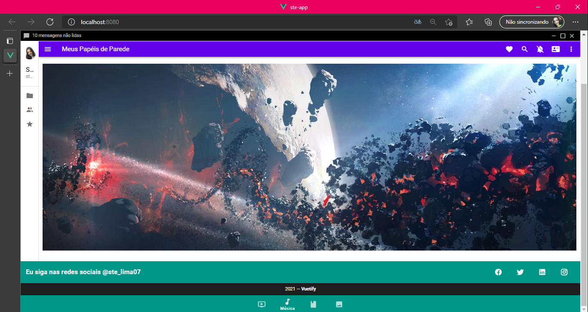
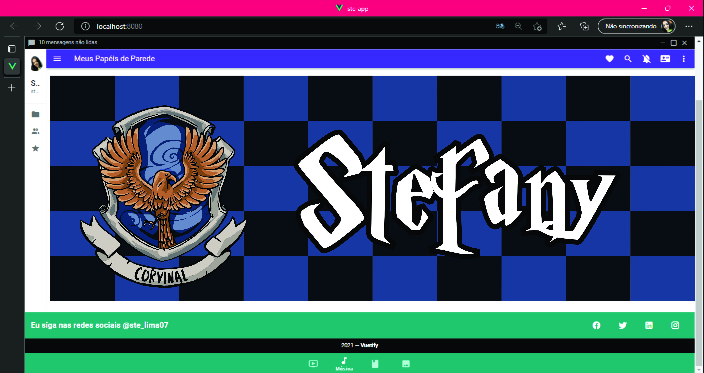
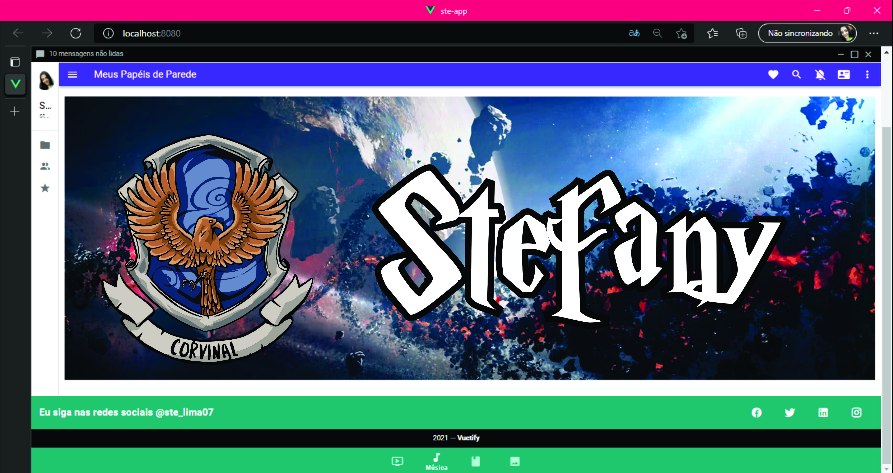
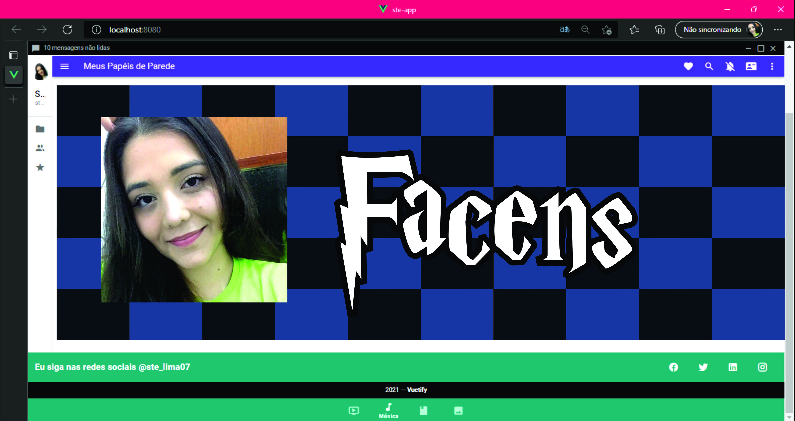

# ste-app

## Project setup
```
npm install
```

### Compiles and hot-reloads for development
```
npm run serve
```

### Compiles and minifies for production
```
npm run build
```

### Lints and fixes files
```
npm run lint
```

### Customize configuration


<h3>Resultado final</h3>






See [Configuration Reference](https://cli.vuejs.org/config/).
